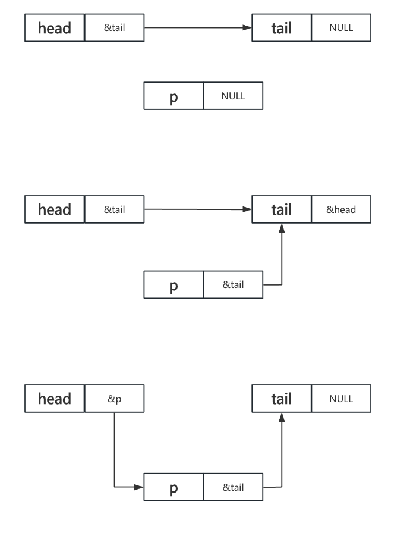

```
#include <stdio.h>
#include <stdlib.h>
#include <string.h>

struct node  // 定义每个节点的类型
{
	char no[12];
	char name[12];
	struct node *next;
};
```
```
//  尾插法创建带头节点的链表
void creat1(struct node *head)
{
	struct node *tail=NULL;  // 定义尾指针tail
	struct node *p=NULL;  // 定义临时指针p
	tail=head;  // 尾指针指向头节点
	while(1)
	{
		printf("creat node ? Y or N");
		rewind(stdin);  // 清空输入缓冲区

		if(getchar()=='N')
			break;

		p = (struct node *)calloc(1,sizeof(struct node));  // 申请一个新节点
		if(p==NULL)
			return;  // 申请失败则返回

		// 输入节点数据
		printf("input no\n");
		rewind(stdin);
		scanf("%s",p->no);
		printf("input name\n");
		fflush(stdin);
		scanf("%s",p->name);

		tail->next=p;  // 尾节点的next指向新节点
		tail=p;  // 尾指针指向新节点
	}
}
```

```
//  头插法创建带头节点的链表
void creat2(struct node *head)
{
	struct node *p=NULL;
	while(1)
	{
		printf("creat node ? Y or N");
		rewind(stdin);

		if(getchar()=='N')
			break;
		p = (struct node *)calloc(1,sizeof(struct node));
		if(p==NULL)
			return;

		printf("input no\n");
		rewind(stdin);
		scanf("%s",p->no);
		printf("input name\n");
		rewind(stdin);
		scanf("%s",p->name);

		p->next=head->next;  // 新节点的next指向头节点的next
		head->next=p;  // 头节点的next指向新节点
	}
}
```

```
void printList(struct node *head)  // 遍历链表
{
	struct node *p=NULL;
	for(p=head->next;p!=NULL;p=p->next)
		printf("no:%s\tname:%s\n",p->no,p->name);
}

int modify(struct node *head,char *no)  // 选择插入模式（头插/尾插）
{
	struct node *p=NULL;
	char name[12];
	for(p=head->next;p!=NULL;p=p->next)
		if(strcmp(p->no,no)==0)
		{
			printf("input new name\n");
			gets(name);

			strcpy(p->name,name);
			printf("update success!\n");
			return 1;
		}
	return 0;
}

void main()
{
	struct node *head=NULL;
	struct node *p=NULL;

	head = (struct node *)calloc(1,sizeof(struct node));
	
	creat2(head);
	printList(head);	
}
```